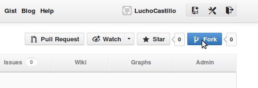

=========================
Aprendiendo a usar GitHub
=========================

Crear una cuenta
----------------

Para crear una cuenta GitHub vamos a seguir los siguientes pasos:

1. Entrá a `GitHub <https://www.github.com>`_.

.. image:: imagenes/github1.png
    :scale: 60 %
    :align: center

2. Hacé clic en *Singnup and Pricing*, de la barra de herramientas de la página.

.. image:: imagenes/github2.png
    :scale: 80 %
    :align: center
    
3. Ahora en *Create a free account*, para una cuenta gratuita.

.. image:: imagenes/github3.png
    :scale: 60 %
    :align: center
    
4. Finalmente, solo habrá que llenar un pequeño formulario con los siguientes datos:
    * Nombre de usuario.
    * Dirección email.
    * Contraseña.
    * Confirmar contraseña.

.. image:: imagenes/github4.png
    :scale: 80 %
    :align: center
    

Manejo de repositorios
----------------------

¿Cómo crear un repositorio?
***************************

Para crear un repositorio en GitHub, solo hay que seleccionar el botón *"Create a New Repo"*, de la barra de herramientas, habiendo entrado a `GitHub <https://www.github.com>`_ con tu cuenta:

.. image:: imagenes/github5.png
    :scale: 80 %
    :align: center
    
Ahora habrá que llenar dos datos:

1. Nombre del repositorio
2. Descripción del repositorio (opcional)

.. image:: imagenes/github6.png
    :scale: 80 %
    :align: center
    
¡Listo! 
Repositorio creado, ahora lo vas a poder ver en tu perfil.

Crear un proyecto
+++++++++++++++++

Al crear el repositorio, inmediatamente nos va a llevar a él. Como nuestro proyecto no tiene nada en su interior, no nos va a mostrar más que una ayuda para subir archivos y proyectos.

Para crear un proyecto desde cero, habrá que comenzar creando los archivos del mismo y luego subiéndolos a la página.

En el primer recuadro de la ayuda, verás una serie de comandos para el terminal.

    touch README.md
    git init
    git add README.md
    git commit -m "comentario"
    git remote add origin https://github.com/LuchoCastillo/Repositorio.git
    git push -u origin master

Antes de seguirlos, tendrás que instalar git: ::

    sudo apt-get install git

Subir proyecto
++++++++++++++

Para subir un proyecto ya realizado a GitHub, habrá que seguir exactamente los mismos pasos, ya que para iniciar un proyecto nuevo, habrá que subir los archivos creados y luego modificarlos en el editor de la página.

En este caso, los archivos junto con su contenido, ya están hechos. Solo hay que subirlos y editarlos si surge algún inconveniente.

Para subir un archivo hay que ubicarse en la carpeta del repositorio y seguir estos pasos:

    git add archivo
    git commit -m "comentario"
    git push

Es importante realizar los 3, ya que si no se ingresa un comentario, no se realiza el cambio.

Para adquirir un poco más de práctica y conocer más comandos de ``git``, pueden ingresar a este `turorial <try.github.com/>_` bastante práctico.

Colaborar en un proyecto ajeno
------------------------------

Para colaborar en un proyecto ajeno simplemente basta con buscarlo dentro de los repositorios, y luego presionar el botón *fork*. Esto genera automaticamente una copia del mismo en tu perfil.

Al terminar tus modificaciones podrás presionar *Pull Request* para envierselo al creador del mismo.

.. image:: imagenes/github9.png
    :scale: 80 %
    :align: center
    

